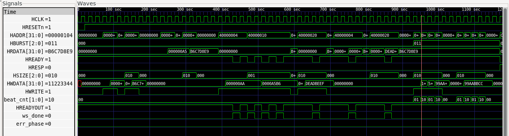
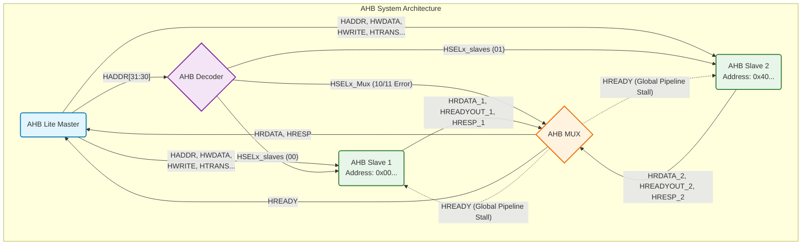

# AMBA AHB Lab

**Author:** Muhammad Saleem  
**Program:** INSPIRE - PSEB National Semiconductor Upskilling Program (Digital IC Design & Verification)

## Overview

This repository contains the RTL implementation and verification of an Advanced High-performance Bus (AHB) System-on-Chip architecture. The system consists of an AHB-Lite Master, an Address Decoder, a Multiplexer, and two memory-mapped Slaves.

The goal of this lab was to debug and finalize the AHB infrastructure by implementing missing protocol features and ensuring strict adherence to the AMBA AHB specification.

---

## Task 2: Bug Fixes & Verification

The provided starter code contained intentional protocol violations and missing features. The following fixes were implemented and verified via the testbench (`AHB_tb.v`):

1. **Master Protocol Violation Fix:** The master's state machine was updated to stall when `HREADY` is low, preventing address overwrites during wait-states.
2. **Slave 1 Address Latch Fix:** Added chip-select conditions (`HSELx`) to prevent the slave from blindly capturing addresses not meant for it.
3. **Wait-State Insertion (TC3):** Implemented a 1-cycle `HREADYOUT` stall in Slave 2 to simulate slow peripheral memory.
4. **INCR4 Burst Support (TC4):** Added a `beat_cnt` to the Master FSM to correctly generate fixed-length 4-beat bursts and auto-return to IDLE.
5. **Default Slave / Error Response (TC5):** Added a 2-cycle `HRESP = 1` error sequence in the MUX for unmapped memory regions.

### Waveform Verification

Below is the GTKWave simulation output verifying all 5 test cases, including the wait-state stalls, INCR4 burst counting, and the 2-cycle error response.

_(Note: Please save your GTKWave screenshot as `ahb_waveform.png` in this folder so it renders here)._

---

## Task 3: AHB System Block Diagram

Below is the block diagram representing the `AHB_TOP.v` architecture implemented in this lab. It illustrates the data and control flow between the Master, Decoder, Slaves, and the Multiplexer.

---

## Task 4: High-Speed and Low-Speed SoC Peripherals

In AMBA-based SoC designs, peripherals are separated based on bandwidth. High-speed peripherals sit on high-bandwidth buses (like AHB or AXI), while low-speed peripherals sit on simpler, low-power buses (like APB) connected via a bridge.

### 5 High-Speed Peripherals (Typically on AHB/AXI)

1. **DDR Memory Controller**
   - **Description:** Manages access to external Dynamic RAM (DDR3/DDR4). Must handle complex timing and refresh cycles.
   - **Typical Data Rates:** 10s of GB/s.
   - **Bus Requirement:** High-performance AXI or AHB (requires burst support and wide data buses like 64-bit/128-bit).
   - **Application:** Main system memory for the CPU and operating system.

2. **Gigabit Ethernet MAC**
   - **Description:** Handles the Media Access Control layer for wired network communications.
   - **Typical Data Rates:** 1 Gbps (or 10 Gbps for newer standards).
   - **Bus Requirement:** AHB or AXI, usually requiring a DMA engine to stream packets directly to RAM without CPU intervention.
   - **Application:** Internet routing, local network connectivity.

3. **PCIe (Peripheral Component Interconnect Express) Controller**
   - **Description:** High-speed serial expansion bus for attaching high-performance components.
   - **Typical Data Rates:** Up to 32 GB/s (PCIe 4.0 x16).
   - **Bus Requirement:** High-speed AXI with strict latency and high throughput requirements.
   - **Application:** Graphics cards (GPUs), NVMe solid-state drives, high-end network cards.

4. **USB 3.0 / 3.1 Controller**
   - **Description:** Manages communications with external Universal Serial Bus devices.
   - **Typical Data Rates:** 5 Gbps to 10 Gbps.
   - **Bus Requirement:** AHB/AXI for data payload transfers, often paired with APB for slow configuration registers.
   - **Application:** External storage drives, high-res webcams, fast data transfer ports.

5. **DMA (Direct Memory Access) Controller**
   - **Description:** Offloads the CPU by independently transferring data blocks between memory and peripherals.
   - **Typical Data Rates:** Dependent on bus clock, easily reaching multi-GB/s.
   - **Bus Requirement:** Must act as an AHB or AXI **Master** to initiate burst transfers.
   - **Application:** Streaming audio to a DAC, moving camera frames to memory.

### 5 Low-Speed Peripherals (Typically on APB)

1. **UART (Universal Asynchronous Receiver-Transmitter)**
   - **Description:** Facilitates asynchronous serial communication between devices using simple RX/TX lines.
   - **Typical Data Rates:** 9.6 kbps to a few Mbps (e.g., 115200 baud).
   - **Bus Requirement:** APB (Advanced Peripheral Bus). Does not need burst or pipeline support.
   - **Application:** Serial debug consoles, GPS modules, Bluetooth modules.

2. **I2C (Inter-Integrated Circuit) Controller**
   - **Description:** A simple two-wire (SDA, SCL) serial protocol for short-distance board-level communication.
   - **Typical Data Rates:** 100 kbps (Standard), 400 kbps (Fast), up to 3.4 Mbps (High-Speed).
   - **Bus Requirement:** APB.
   - **Application:** Reading temperature sensors, EEPROMs, or configuring audio codecs.

3. **SPI (Serial Peripheral Interface) Controller**
   - **Description:** A synchronous serial communication interface used for short-distance communication, generally faster than I2C.
   - **Typical Data Rates:** 1 Mbps to 50+ Mbps.
   - **Bus Requirement:** APB.
   - **Application:** SD cards, simple LCD displays, SPI Flash memory.

4. **GPIO (General Purpose Input/Output) Controller**
   - **Description:** Provides programmable pins that can be set as inputs or outputs by the CPU.
   - **Typical Data Rates:** Very low speed (Hz to kHz, limited by software toggle rates).
   - **Bus Requirement:** APB.
   - **Application:** Blinking LEDs, reading push-buttons, driving simple relays.

5. **Watchdog Timer (WDT) / System Timer**
   - **Description:** A hardware timer that triggers a system reset if it is not periodically cleared by software (to recover from crashes).
   - **Typical Data Rates:** Near zero (only requires occasional register reads/writes).
   - **Bus Requirement:** APB.
   - **Application:** System reliability in embedded systems, precise scheduling interrupts.
