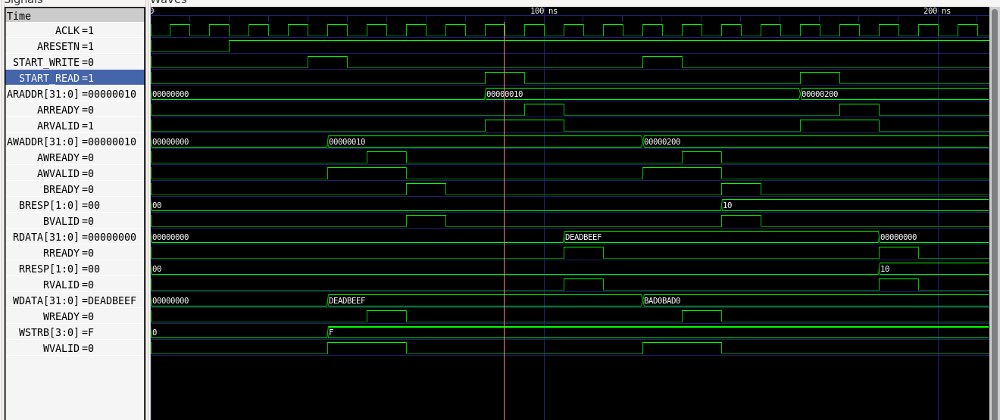

# AMBA AXI-Lite Lab

**Author:** Muhammad Saleem  
**Program:** INSPIRE - PSEB National Semiconductor Upskilling Program (Digital IC Design & Verification)  

## Overview
This repository contains the RTL implementation and verification of an Advanced eXtensible Interface (AXI4-Lite) System-on-Chip architecture. The system consists of an AXI-Lite Master and a memory-mapped Slave designed completely from scratch. 

The goal of this lab was to design the complete AXI-Lite infrastructure by implementing a strict Finite State Machine (FSM) for the Master and ensuring strict adherence to the AMBA AXI handshaking protocol across all five independent channels.

## Lab Details & Verification
The design successfully implements the required two-way handshake mechanism where transfers only occur when both `VALID` and `READY` are asserted. The following features were implemented and verified via the testbench (`axi_tb.v`):

1. **Independent Channel Execution:** The master correctly drives the Write Address (AW) and Write Data (W) channels simultaneously to initiate transactions.
2. **Standard AXI Write (TC1):** Verified that the slave successfully captures the payload and returns an `OKAY` (`2'b00`) response on the B channel.
3. **Standard AXI Read (TC2):** Verified that the master requests data (AR channel), and the slave successfully fetches and returns it (R channel) with an `OKAY` response.
4. **Out-of-Bounds Write Error (TC3):** Implemented memory boundary protection; writing beyond the 256-word limit successfully triggers a `SLVERR` (`2'b10`) response on the B channel.
5. **Out-of-Bounds Read Error (TC4):** Reading from an unmapped memory region successfully triggers a `SLVERR` response on the R channel.

### Waveform Verification
Below is the GTKWave simulation output verifying all 4 test cases, including the standard read/write handshakes and the slave error responses.

*(Note: Please save your GTKWave screenshot as `axi_waveform.png` in this folder so it renders here).*